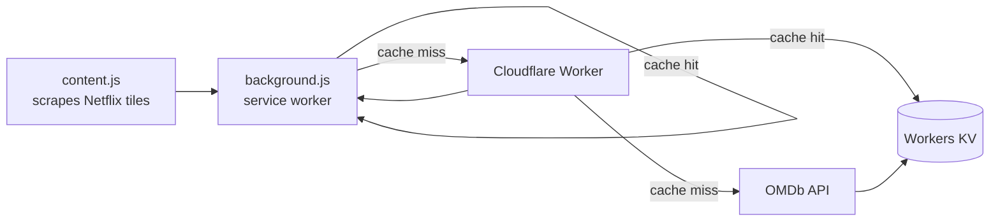

# Netflix IMDb Rating Filter

A Chrome extension that dims or hides Netflix titles below an IMDb rating you choose — so you stop scrolling past 4.2-star noise to find something worth watching.


## What it does

- Scans every title tile on Netflix (browse rows, search, "my list," detail-page recommendations)
- Looks up its IMDb rating and either **dims** it (default) or **hides** it entirely, based on a threshold you set
- Shows the actual rating as a badge on every tile, high and low alike
- Caches results so repeat views cost nothing — locally in the browser, and again server-side so it's shared across all your devices

## Why a server component?

IMDb has no public API. Ratings come from [OMDb](https://www.omdbapi.com/), a third-party proxy with a per-key daily request cap. Calling OMDb straight from the browser would mean:

- Baking your OMDb key into the extension, visible to anyone who opens dev tools
- Burning your daily quota once per browser profile, with no sharing across devices

Instead, a small [Cloudflare Worker](./worker) sits in between:



The Worker holds the OMDb key as an encrypted secret — it never ships in the extension — and caches every lookup in Workers KV so the same title is never fetched from OMDb twice. It also rate-limits by IP to keep the shared key from being drained if the endpoint is ever hit directly.

## Install

1. Clone this repo
2. `chrome://extensions` → enable **Developer mode** → **Load unpacked** → select the repo root
3. Open the extension popup, set your rating threshold and Dim/Hide preference, hit Save
4. Reload any open Netflix tab

No API key needed on your end — the bundled proxy URL in `background.js` already points at a live Worker. If you'd rather run your own (recommended if you fork this), see below.

## Running your own proxy

```bash
cd worker
npm install
npx wrangler login
npx wrangler kv:namespace create RATINGS_KV
# paste the printed id into wrangler.toml's [[kv_namespaces]] block
npx wrangler secret put OMDB_KEY
# paste your own OMDb key when prompted — get one free at omdbapi.com/apikey.aspx
npm run deploy
```

Then update `PROXY_URL` in `background.js` and the matching entry in `manifest.json`'s `host_permissions` to point at your new Worker URL.

## Project layout

```
.
├── manifest.json       Extension config (Manifest V3)
├── background.js       Service worker — talks to the proxy, caches locally
├── content.js          Scrapes Netflix DOM, applies dim/hide + rating badge
├── content.css          Styles for dimmed/hidden tiles and the rating badge
├── popup.html / .js     Settings UI — threshold, dim/hide toggle, usage stat
└── worker/
    ├── src/index.js     Worker: OMDb proxy, KV cache, rate limiting
    └── wrangler.toml    Worker config (KV binding, rate limit binding)
```

## Notes and limitations

- Netflix's DOM changes without notice; tile matching relies on the `data-uia` attribute rather than CSS classes, which is more stable but not guaranteed forever
- Title matching is string-based via OMDb — occasional mismatches on ambiguous or foreign-language titles are possible; unmatched titles are left visible rather than hidden
- Movies and TV series are both covered (no `type` filter is applied on the OMDb query)

## License

No license file yet — all rights reserved by default. Open an issue if you'd like to use this under a specific license.
